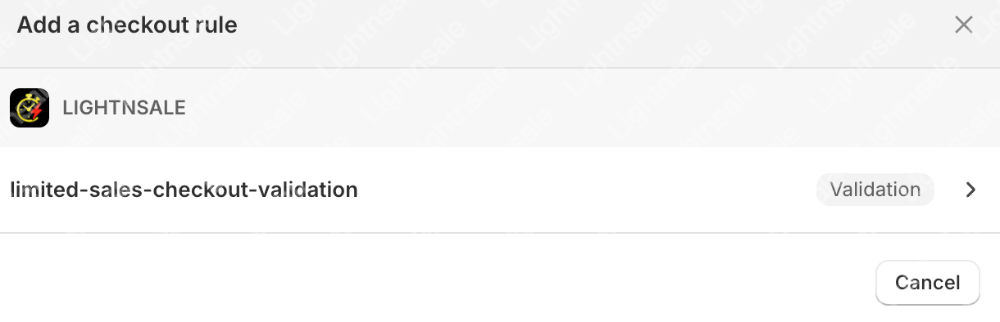
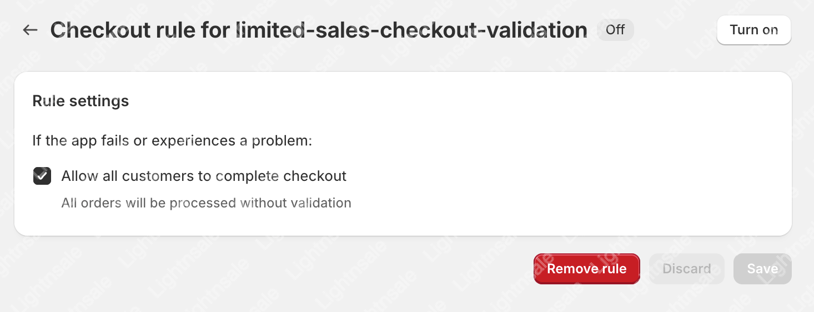

# Limited Product Purchase Restriction Guide

To prevent customers from purchasing multiple units of a limited product, you can enable the **anti-fraud feature** to enforce a rule that **only one limited item can be purchased per order**.

## 🛠️ Setup Path

Please follow the steps below to configure this setting:

1. Navigate to the admin panel:  
   **Setting > Checkout > Checkout rules > Add rule**

   

2. In the rule configuration, enable the following option:

   - Select rule type: `limited-sales-checkout-validation`

   

## 🔒 Feature Overview

Once this rule is enabled:

- Each order is permitted to include **only one** limited item.
- Orders containing more than the permitted quantity (**1**) will be **automatically blocked during checkout**.
- This mechanism effectively reduces bot activity and bulk purchasing by resellers.

## 📬 Need Help?

Have questions or feedback? Reach out to our support team anytime:

📮 Email: **support@lightnsale.com**  
⏱️ We will respond as soon as possible.