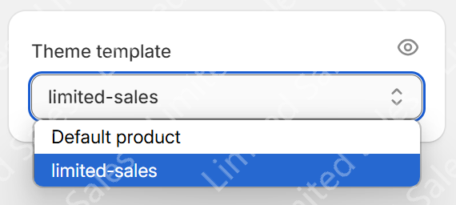
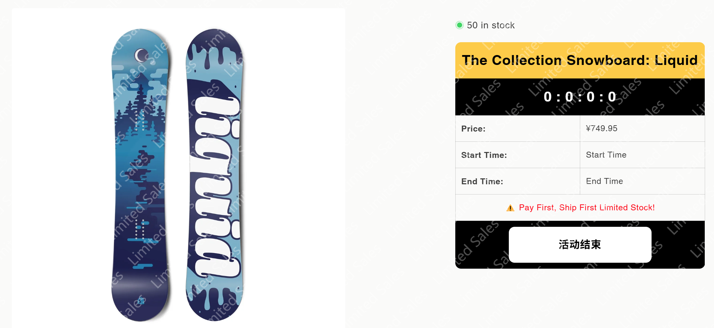
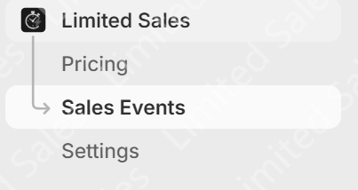
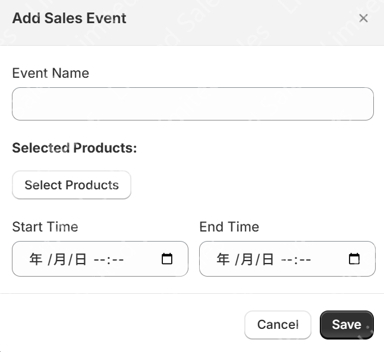
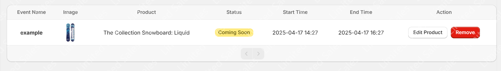
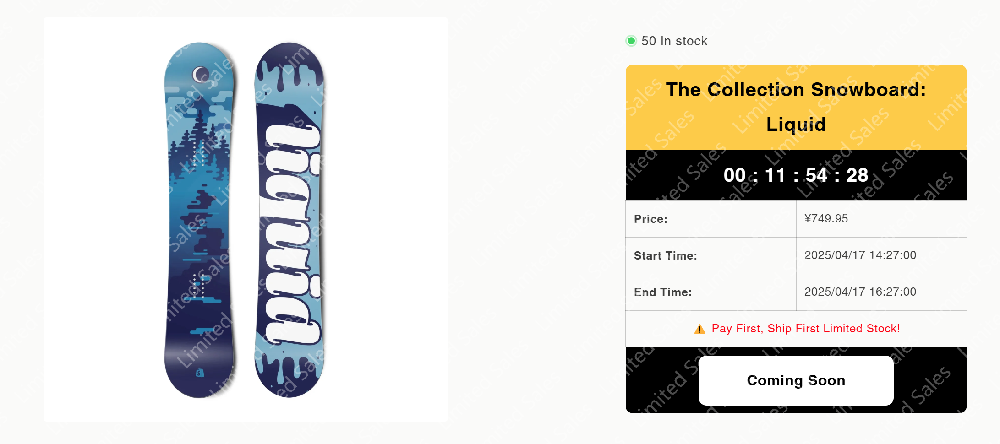

# Assign the Limited Sales Template to a Product

To apply your customized **Limited Sales** template to a product, follow these steps:

1. Select a **draft product** from your product list.
2. In the **Product settings**, locate the **Theme template** option.
3. Choose the template you previously created (e.g. `Limited Sales`).
4. Click **Save** to apply changes.

## Optional: Preview the Product Page

After saving, you may click **Preview** to see how the product page appears with the Limited Sales layout applied.

## Set Up a Sales Event in the Limited Sales Plugin

1. In your Shopify admin, open the **Limited Sales** App.
2. Navigate to the **Sales Events** section.

## Create a New Sales Event

Click **Add Event** to create a new limited-time sales event.

## Event Created Successfully

Once saved, your event will appear in the list of upcoming or active sales.

## Event Started

As the start time approaches, the event will automatically transition into an active state.

## 📬 Need Help?

Have questions or feedback? Reach out to our support team anytime:

📮 Email: **support@limited-sales.com**  
⏱️ We will respond as soon as possible.
