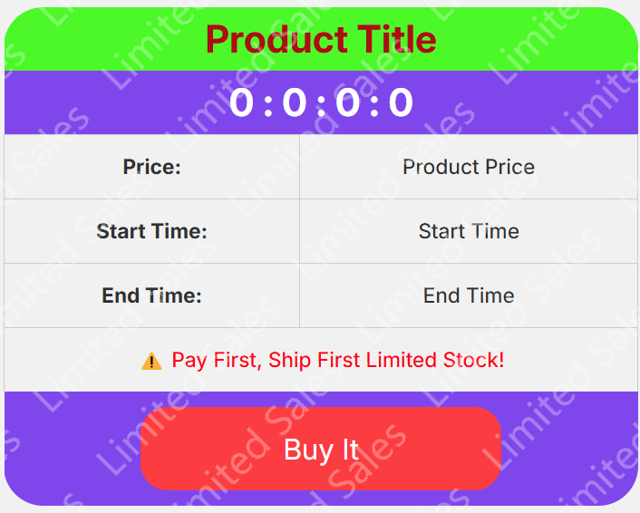
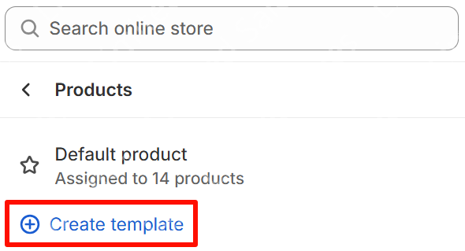
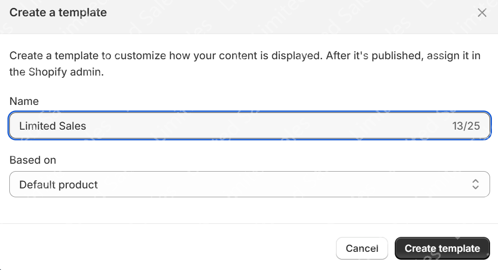
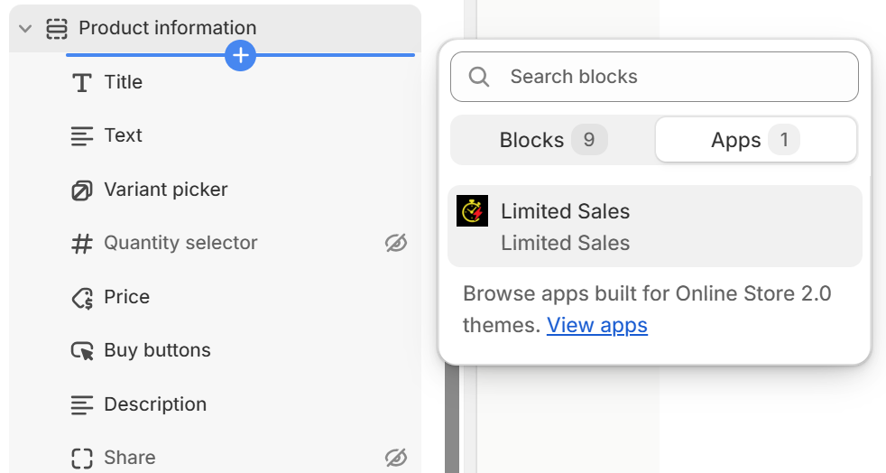
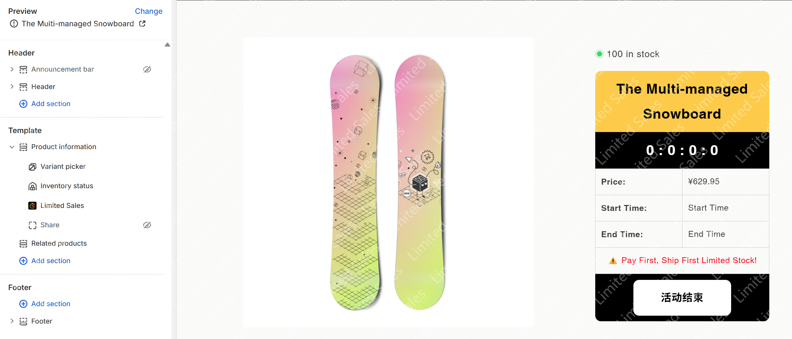

# 🎨 Customize Your Limited Sales Component

## Design a purchase UI that aligns with your brand

Tailor the appearance of your Limited Sales component to match the visual identity of your store.

- 🧩 **Configuration Panel (Left)**: Adjust layout, border radius, colors, and other styling options  
- 👀 **Live Preview (Right)**: Instantly preview any changes you make in real time

Once your design is finalized, click the **"Save"** button. You will see the following confirmation message:

> ✅ `Setting updated`

### 🖼️ Preview Example

## Integrate the Component into Your Shopify Theme

### Step 1: Access the Theme Editor

Navigate to the theme customization section:  **Online Store > Themes > Customize**

### Step 2: Name Your Template

Assign a clear and meaningful name to the new template — for example:  `Limited Sales`.

### Step 3: Add the Limited Sales UI Block

In the **Product Information** section, click **Add block**, then select:  `Limited Sales`

### Step 4: Configure the Component Style

Choose the style you created earlier, and make any final adjustments to match your storefront aesthetics.

💡 **Pro Tip**: Use your brand’s primary color to highlight key elements.

## 📬 Need Help?

Have questions or feedback? Reach out to our support team anytime:

📮 Email: **support@limited-sales.com**  
⏱️ We will respond as soon as possible.

