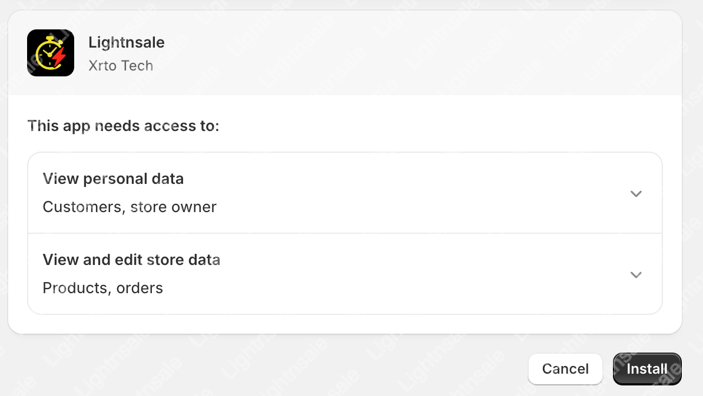

# How to Install the Lightnsale App

Welcome to **Lightnsale App** — your all-in-one tool to create flash sale events, boost conversion rates, and fight against bots!

## Installation Steps

Just a few simple steps to install the app into your Shopify store:

### ✅ Click the Installation Link

Click the link below to go to the Shopify authorization page:

👉 [Click here to install Lightnsale App](https://apps.shopify.com/lightnsale)

> 🔐 During the installation, Shopify will ask for permission to access necessary store data (such as orders, products, and event settings). Click **“Install”** to proceed.
>
> 

## 📬 Need Help?

Have questions or feedback? Reach out to our support team anytime:

📮 Email: **support@lightnsale.com**  
⏱️ We will respond as soon as possible.
